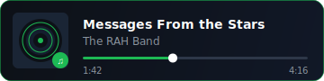

<div align="center">


<br/>


<br/>


[](https://open.spotify.com/search/Messages%20From%20the%20Stars%20The%20RAH%20Band)

<br/>

</div>

<br/>

---

<div align="center">

**`// about me`**

</div>

<br/>

```yaml
name      : Al Ghozali Ramadhan
degree    : Computer Science Student
focus     : Indie 3D Game Development
craft     : Modeling · Animating · Scripting
code      : Python · C++ · C#
currently : working on something cool
interests : games · design · tech
collab    : open to interesting projects
status    : always building something new
```

<br/>

<div align="center">

</div>

<br/>

<div align="center">

**`// tools & tech`**

<br/>

<table border="0" cellspacing="0" cellpadding="10">
<tr>
<td align="center"><sub>LANGUAGES</sub></td>
<td align="center"><sub>GAME DEV</sub></td>
<td align="center"><sub>TOOLS</sub></td>
</tr>
<tr>
<td align="center">


</td>
<td align="center">


</td>
<td align="center">


</td>
</tr>
</table>


</div>

<div align="center">


<br/>


<sub>✦ &nbsp; crafted in the void &nbsp; ✦ &nbsp; <code>@AlGhozaliRamadhan</code> &nbsp; ✦</sub>

</div>
