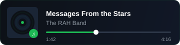

 

---

`// about me`

 

Computer Science student and solo indie game developer. I build 3D games entirely on my own — handling everything from modeling to animation to code. **C++** and **C#** are my languages of choice, with Unity and Blender as my main tools. When I'm not studying, I'm deep in a project, figuring out how to make something that actually feels good to play.

 

---

`// tools & tech`

 

<table border="0" cellspacing="0" cellpadding="6">
<tr>
  <td align="center" width="220">LANGUAGES</td>
  <td align="center" width="200">GAME DEV</td>
  <td align="center" width="200">TOOLS</td>
</tr>
<tr>
  <td align="center">
    
     
    
     
    
     
    
  </td>
  <td align="center">
    
     
    
  </td>
  <td align="center">
    
     
    
     
    
  </td>
</tr>
</table>

 

 

---

`// currently building`

 

> 🚧 Working on something. Details soon.

 

---

